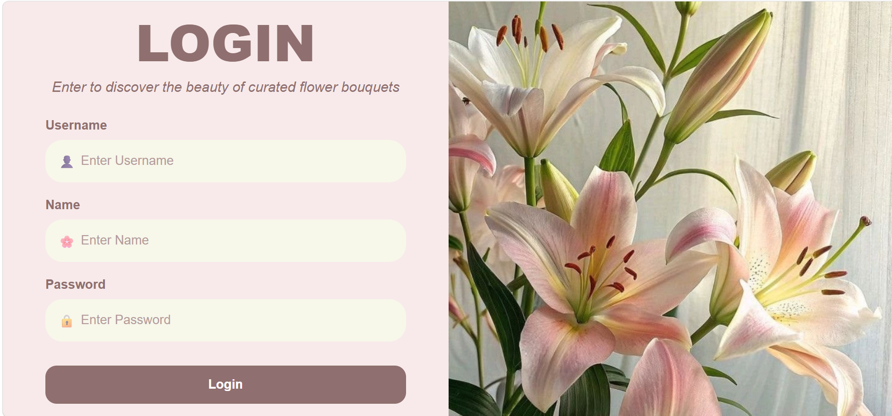
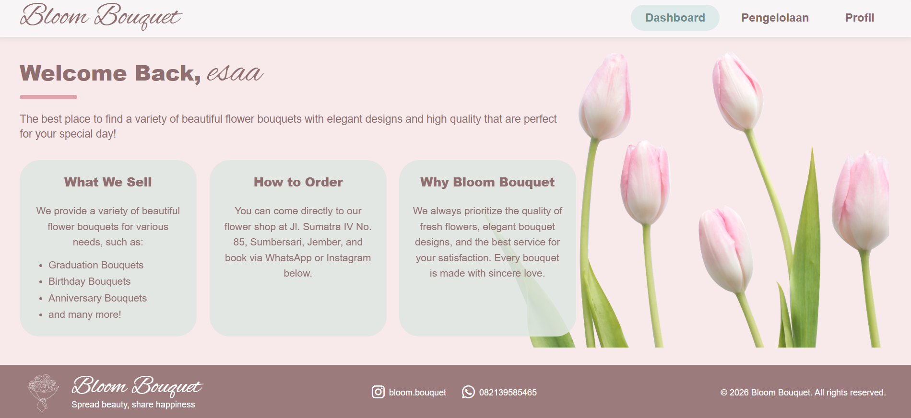
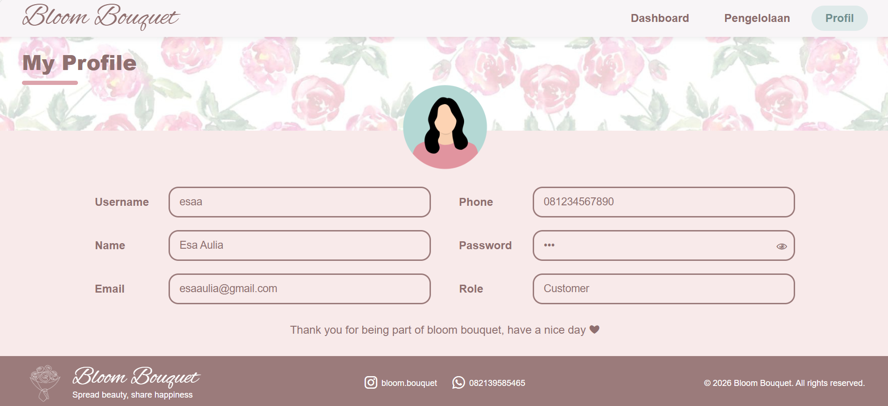
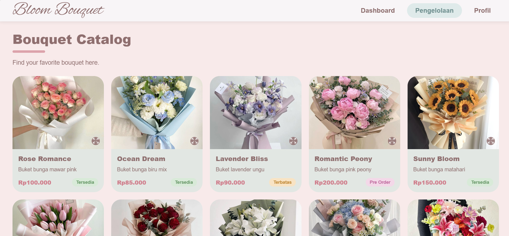

# UTS PWEB

## Identitas
Nama: Esa Aulia
NIM: 242410101057
Kelas: B

---

## Deskripsi Project
Website **Bloom Bouquet** adalah website katalog dan pengelolaan buket bunga yang dibuat menggunakan Laravel dengan konsep MVC. Website ini memungkinkan user untuk melakukan login, melihat dashboard, mengakses halaman profile, serta melihat daftar produk bouquet yang ditampilkan secara dinamis.

Pada halaman pengelolaan, data produk seperti nama, harga, deskripsi, status, dan gambar disusun dalam bentuk array di controller, kemudian dikirim ke view dan ditampilkan menggunakan perulangan Blade (@foreach). Hal ini menunjukkan penerapan data rendering secara dinamis.

Selain itu, website ini juga menerapkan request parameter untuk mengambil data dari form login, session untuk menyimpan data user sementara, serta redirect untuk mengatur perpindahan halaman setelah proses login.

Dengan menggunakan Blade Template Engine, struktur tampilan dibuat lebih rapi melalui penggunaan layout, section, dan component seperti navbar dan footer.

---

## Teknologi yang Digunakan
- Laravel (MVC)
- Blade Template Engine
- CSS

---

## Fitur
- Login
- Dashboard
- Profile
- Pengelolaan Produk Bouquet

---

## Screenshot

### Login

### Dashboard

### Profile

### Pengelolaan

